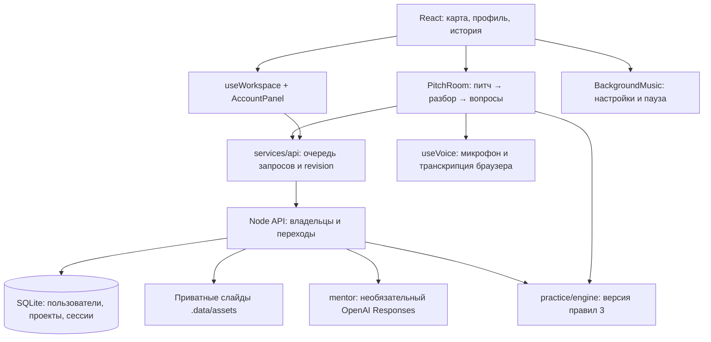
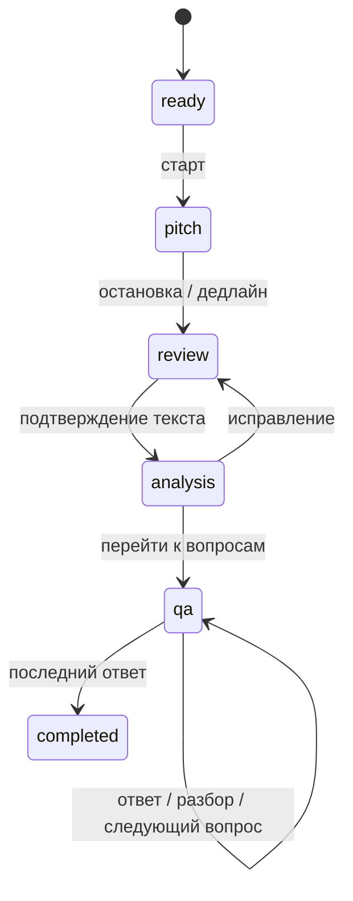

# Архитектура Pitch Arena

Обновлено: 28 сентября 2026.

## Что реализовано

React 19 / JavaScript / Vite на клиенте, модульный Node.js 24 API, SQLite и приватное файловое хранилище. Это один сервер приложения. Общая игровая логика переиспользуется клиентом для гостевого режима и сервером для аккаунтов. API-контракты проверяются Zod.

### Границы модулей

| Модуль | Ответственность |
| --- | --- |
| `src/main.jsx` | Главный экран, навигация, подготовка и связь остальных компонентов |
| `src/JourneyMap.jsx`, `src/game-data.js` | Карта, арены, прототипы панелей, кампания и достижения |
| `src/PitchRoom.jsx` | Показ этапов и обратной связи, ручной ввод, таймер и восстановление |
| `src/practice/engine.js` | Чистые функции анализа, вопросов, оценки, сравнения и переходов гостевой игры |
| `src/hooks/useVoice.js` | Захват аудио, распознавание, освобождение устройств |
| `src/hooks/useWorkspace.js`, `src/services/api.js` | Данные аккаунта, API, последовательные изменения тренировки |
| `src/components/AccountPanel.jsx` | Вход, регистрация, выбор проектов, явный импорт старой истории |
| `src/components/BackgroundMusic.jsx` | Музыка, громкость, пауза в комнате и скрытой вкладке |
| `src/components/Results.jsx`, `PracticeFeedback.jsx`, `MentorFeedback.jsx` | История, цитаты, рубрика, ИИ-советы, сравнение и экспорт |
| `server/app.js` | HTTP-маршруты, права владельца, состояние, награды и файлы |
| `server/auth.js`, `schemas.js`, `store.js` | Вход, проверка контрактов, SQL и схема БД |
| `server/mentor.js` | Единственная точка подключения модели; тайм-аут, Structured Outputs и проверка цитат |

Сервер не принимает готовые XP/баллы от клиента. Он пересчитывает результат и сохраняет его один раз на ID тренировки. Переходы подтверждаются сервером, а `revision` предотвращает тихую перезапись из второй вкладки. Внутри одного процесса изменения сессии сериализуются.

### Хранение

| Данные | Гость | Аккаунт |
| --- | --- | --- |
| Профиль, результаты | `pa-profile`, `pa-history` в localStorage | SQLite |
| Черновик | `pa-draft` | SQLite + резерв текста в `pa-draft:<userId>` |
| Слайды | File/Blob до выхода/перезагрузки | Приватные файлы API, метаданные SQLite |
| Аудио и камера | В памяти браузера | В памяти браузера; на API не отправляются |
| Язык и звук | `pa-lang`, `pa-audio` | Те же настройки текущего устройства |
| Каталог и сценарии | Версия исходного кода | Версия исходного кода |

Вход не переносит гостевую историю автоматически. Импорт выполняется отдельной кнопкой, не дублируется и помечается `serverVerified:false`. Серверные проекты имеют постоянные UUID: сравнение попыток не зависит от одинаковых названий разных проектов. Гостевые результаты по-прежнему сравниваются по нормализованному названию. Версия оценки, арена и лимит времени должны совпадать.

### Сессия

Пять основных вопросов и максимум одно уточнение. Балл: до 50 за исходный питч и до 50 за ответы. Цитаты объясняют найденные элементы; правила не проверяют истинность заявленных цифр. ИИ добавляет содержательный разбор, учитывает слайды и формулирует вопросы, сохраняя темы оценки. При недоступном ИИ остаётся прозрачный разбор по правилам.

Незавершённая тренировка не приносит XP. Выход сохраняет черновик, перезагрузка не сбрасывает дедлайн. После восстановления микрофон запускается вручную. Полная запись аудио после перезагрузки недоступна.

## Решения этой итерации

Ранее были предложены TypeScript, PostgreSQL и объектное хранилище. Для первого работающего сервера выбран Node.js/JavaScript + Zod + SQLite: локальный запуск не требует внешней БД и сервисов. Это осознанный промежуточный вариант для одного экземпляра API, а не уже реализованная инфраструктура масштабирования. Код не содержит фиктивного PostgreSQL-адаптера.

Музыка предоставлена владельцем; из исходного M4A подготовлена MP3-копия. По умолчанию звук выключен, включается действием пользователя, настройки сохраняются. Во всей комнате питча музыка останавливается, чтобы не попадать в микрофон и не перекрывать вопросы.

## Где улучшать дальше

1. **Проверить реальный ИИ на примерах RU/EN.** Сейчас адаптер и ошибки проверены без действующего ключа. Нужны оценка качества вопросов/слайдов, задержки и стоимость сессии, затем выбор модели по результатам.
2. **Подготовить закрытый пилот.** Восстановление пароля, подтверждение email, удаление своих данных, резервные копии и наблюдаемость. Серверная транскрипция нужна для одинакового поведения браузеров.
3. **Продолжить разделение кода.** Вынести страницы и Setup из большого `main.jsx`, сервис сессий из `server/app.js`; перевести общие контракты на TypeScript, локализованные строки — в словари. Текущий UI и HTTP не должны определять игровые правила.
4. **При росте нагрузки.** PostgreSQL, приватное объектное хранилище, миграции и очередь задач ИИ. Блокировки и лимиты в памяти заменить общей координацией. До этого не запускать несколько процессов API с общей БД.

## Задел под идеи владельца

[BACKLOG.md](BACKLOG.md) сохраняет все 15 направлений. Музыка частично реализована; остальные идеи не превращены автоматически в задачи.

- Гид и учебный процесс: локализованные сценарии подсказок и отдельный прогресс обучения.
- Команды: членство и роли проекта, участники сессии, серверный активный спикер и очередь; синхронизация и групповое аудио — отдельный модуль.
- Настоящие инвесторы: проверенные профили и заявки на встречи отдельно от игровых прототипов.
- Хакатоны: события, дедлайны, заявки, жюри и независимая от XP оценка.
- Новости: RSS/API, источники и даты, редакционный статус; внешние тексты считаются данными.
- Админка: серверные роли, управление появляющимися модулями и журнал изменений. Публичного переключателя прав владельца нет.
- Монетизация: права доступа и события оплаты отдельно от игровых наград, после проверки полезности продукта.
- Мобильный клиент: общий API и правила переиспользуются; DOM, карта, медиа и UI потребуют своей реализации.

## Проверки и эксплуатация

`npm test` проверяет игровые правила и сервер: владельцев, вход, версии, повторное завершение, восстановление БД и контракт ИИ. `npm run test:workspace` поднимает временную БД и API для изолированного браузерного сценария аккаунта. `npm run test:browser` проверяет гостевую игру, RU/EN, запись тестового микрофона, повтор и мобильный интерфейс. Команды, ограничения и ключи описаны в [SERVER.md](SERVER.md); запуск — в [README.md](../README.md).

## Уточнение: каталог, админка и монетизация

Владелец сообщил об установленном PostgreSQL; ключ OpenAI и Railway — позже. Следующий предложенный этап: PostgreSQL → серверные роли и админка → публичные карточки стартапов/соцсети → учёт расхода ИИ и тарифов. Это план, текущий сервер продолжает работать на SQLite.

Зафиксированы две независимые линии дохода: подписка пользователя на ИИ-возможности и рекламные заказы стартапа. Сущности, права, квоты, повторные платежные события и критерии готовности описаны в [MONETIZATION.md](MONETIZATION.md). Все новые идеи внесены в [BACKLOG.md](BACKLOG.md), IDEA-012–015.
