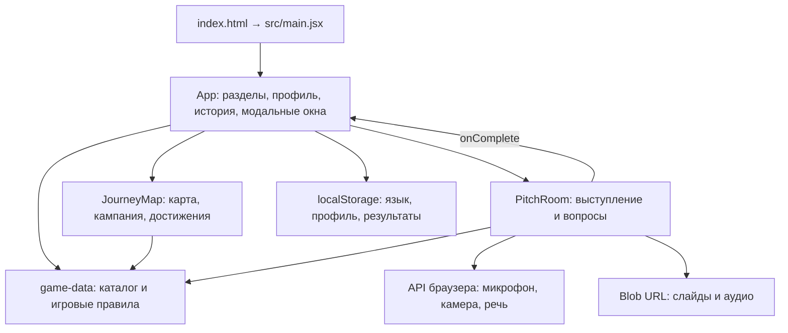
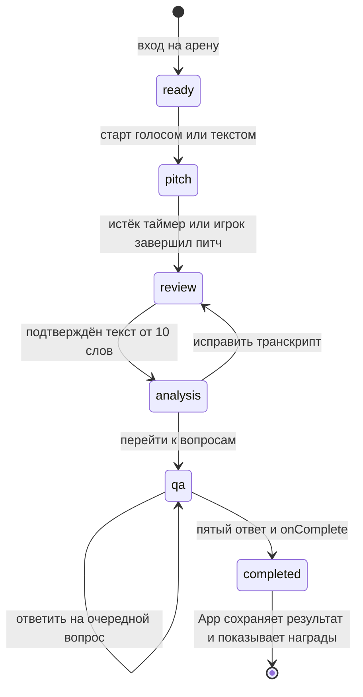
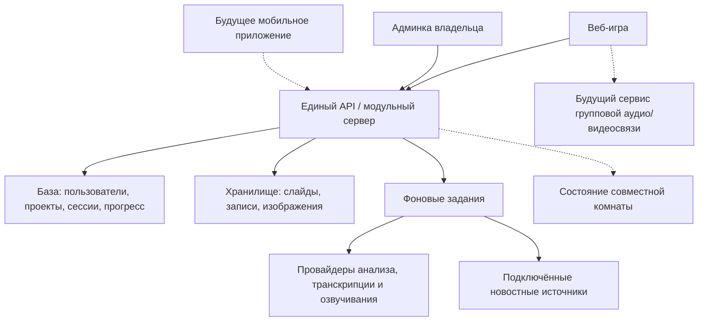

# Архитектура Pitch Arena

Обновлено: 28 сентября 2026.

**Статус:** описание существующего приложения и предложение по его развитию. Реализован только раздел «Текущее устройство». Целевая схема, новые модули и этапы перехода не означают, что их разработка начата или согласована.

Продуктовые идеи владельца отдельно записаны в [BACKLOG.md](BACKLOG.md). Инструкции запуска и описание игры — в [README.md](../README.md).

## 1. Текущее устройство

Pitch Arena — одностраничное клиентское приложение на React 19 и JavaScript, собранное Vite. Оно работает без собственного сервера. Переключение разделов реализовано состоянием React, без URL-маршрутизации. Стили — обычный CSS; русский и английский тексты находятся в компонентах и каталоге игры.

### Файлы и ответственность

| Файл                                                  | Что находится внутри                                                                                                                             |
| ----------------------------------------------------- | ------------------------------------------------------------------------------------------------------------------------------------------------ |
| [src/main.jsx](../src/main.jsx)                       | Точка входа, App, навигация, главная, инвесторы, профиль, история, рейтинг, подготовка питча, результаты, камера, общие компоненты и иллюстрации |
| [src/JourneyMap.jsx](../src/JourneyMap.jsx)           | Карта Земли, выбор региона и арены, маршрут кампании, отображение достижений                                                                     |
| [src/PitchRoom.jsx](../src/PitchRoom.jsx)             | Этапы сессии, таймер, запись и распознавание речи, проверка транскрипта, вопросы, расчёт результата                                              |
| [src/game-data.js](../src/game-data.js)               | Арены, прототипы инвесторов, состав панелей, кампания, XP и достижения, локальный разбор, вопросы по тексту                                      |
| [src/styles.css](../src/styles.css)                   | Визуальная система, страницы, игровая комната и адаптивные стили                                                                                 |
| [public/portraits](../public/portraits)               | Портреты; происхождение изображений указано в SOURCES.md                                                                                         |
| [tests/game-data.test.js](../tests/game-data.test.js) | Проверки вопросов, анализа текста, соответствия панелей и прогресса                                                                              |
| [artifacts](../artifacts)                             | Снимки интерфейса и отчёты выполненных браузерных проверок; это не серверные данные игроков                                                      |

Карта строится из локальных данных `world-atlas` через `topojson-client` и `d3-geo`. Иконки — Lucide. Фото прототипов лежат в проекте; шрифты загружаются с Google Fonts.

### Состояние и хранение

| Данные                                    | Где находятся сейчас                    | Срок жизни                 |
| ----------------------------------------- | --------------------------------------- | -------------------------- |
| Язык                                      | `localStorage`, ключ `pa-lang`          | До очистки данных браузера |
| Имя, стартап, индустрия, описание         | `localStorage`, `pa-profile`            | До очистки данных браузера |
| Завершённые выступления                   | `localStorage`, `pa-history`            | До очистки данных браузера |
| Выбранный раздел, фильтры, текущая сессия | Состояние React                         | До перезагрузки/выхода     |
| Загруженные слайды, аудио, камера         | File/Blob, Blob URL, MediaStream        | Только текущая сессия      |
| Арены, инвесторы, правила                 | Исходный код                            | Версия приложения          |
| Рейтинг других стартапов                  | Демонстрационные записи в исходном коде | Версия приложения          |

История содержит исходный питч, вопросы и ответы, анализ, сумму запроса, арену, длительности, балл, XP, звёзды, новые достижения и `scoringVersion`. Общая сумма XP и достижения вычисляются из истории; записи первой версии без `xp` учитываются как 100 XP. Сохранения с разных устройств не синхронизируются. Незавершённая сессия не восстанавливается после перезагрузки.

### Жизненный цикл выступления

`completed` на схеме — событие завершения: отдельного состояния с таким именем в `PitchRoom` нет. При выходе до завершения запись в историю не создаётся. Таймер считается относительно конечного времени, а не по количеству срабатываний интервала. После остановки захвата приложение дожидается финального текста распознавания в пределах тайм-аута; при выходе освобождает устройства и Blob URL.

Транскрипция использует Web Speech API, запись — MediaRecorder. Если распознавание недоступно, игрок может прослушать запись и внести текст. Распознавание может выполняться сервисом браузера. Озвучивание вопросов — нейтральный синтетический голос браузера.

Разбор и вопросы локальные, по ключевым темам и шаблонам. Формула балла сейчас находится в `PitchRoom`, а правила XP и достижений частично — в `game-data`. ИИ-провайдера, анализа содержимого слайдов, серверной авторизации, настоящего рейтинга, платежей и админки пока нет.

## 2. Что стоит выделить при следующем изменении кода

Текущей структуры хватает для прототипа. Для команд, событий и серверного ИИ полезно разделить ответственность, сохраняя поведение и текущий дизайн.

- Вынести страницы, модальные окна, иллюстрации и общие UI-компоненты из `main.jsx`.
- Отделить каталог арен и публичных прототипов от правил анализа и прогресса.
- Вынести переходы сессии и расчёт результата в тестируемую игровую логику без React и API браузера.
- Отделить работу с микрофоном, камерой, распознаванием и озвучиванием от экрана комнаты.
- Обращаться к сохранениям через интерфейс хранилища; сначала оставить реализацию на localStorage.
- Вынести словари RU/EN и общие типы данных. TypeScript предлагается для будущих общих контрактов клиента и сервера.

Это план рефакторинга, а не выполненные изменения. Сейчас новых пустых модулей или серверных заглушек в проекте нет.

## 3. Предлагаемая архитектура продукта

Для следующего этапа предлагается **модульный монолит**: один сервер приложения с чёткими границами модулей. Это позволяет постепенно добавлять возможности из бэклога и сохранять единые правила игры.

Существующий React-клиент остаётся веб-интерфейсом. Предлагаемый сервер — Node.js с TypeScript; база — PostgreSQL; файлы — объектное хранилище. Серверный фреймворк, хостинг, поставщики ИИ, речи, платежей и видеосвязи ещё не выбраны. Это проектное предложение, ничего из перечисленного не установлено.

Фоновые задания нужны при подключении долгих операций: загрузки/обработки слайдов, транскрипции, анализа и обновления новостей. На старте можно хранить задания в базе и выполнять их отдельным процессом из того же проекта. Отдельный брокер выбирается только при обоснованной нагрузке.

### Модули и их границы

| Модуль                        | Ответственность                                                     | Идеи из бэклога            |
| ----------------------------- | ------------------------------------------------------------------- | -------------------------- |
| Пользователи и доступ         | Учётные записи, профили, роли, проверка прав                        | IDEA-008–011               |
| Проекты и команды             | Стартап, участники, приглашения, доступ к презентациям              | IDEA-008                   |
| Каталог игры                  | Арены, прототипы, настройки времени, языки, версии сценариев        | IDEA-001, 003, 004         |
| Игровые сессии                | Этапы питча, участники, таймер, вопросы, ответы, завершение         | IDEA-008–010               |
| Прогресс                      | Баллы, XP, звёзды, достижения, рейтинг                              | Развитие существующей игры |
| Медиа и анализ                | Слайды, записи, транскрипты, задания анализа, синтетическая озвучка | IDEA-002, 003, 008         |
| Обучение и гид                | Короткие уроки, контекстные подсказки, прогресс обучения            | IDEA-001, 004              |
| Контент и новости             | Источники, материалы, редакторская проверка, публикации             | IDEA-005                   |
| Реальные инвесторы            | Проверенные аккаунты, заявки на встречи, обратная связь             | IDEA-009                   |
| События                       | Хакатоны, заявки, команды, дедлайны, жюри и результаты              | IDEA-010                   |
| Доступ к платным возможностям | Тарифные права, лимиты, история платежных событий                   | IDEA-007                   |
| Администрирование             | Управление модулями через их сервисы, журнал действий               | IDEA-011                   |

Админка не должна напрямую менять таблицы в обход игровых правил. Она вызывает те же серверные операции с отдельными правами. Реальная встреча и учебная симуляция — разные типы сессий; вымышленный персонаж не становится учётной записью настоящего инвестора.

### Основные сущности

| Сущность                                                 | Связи и назначение                                                               |
| -------------------------------------------------------- | -------------------------------------------------------------------------------- |
| `User`, `Profile`                                        | Учётная запись и игровой профиль                                                 |
| `Project`, `ProjectMember`                               | Стартап и доступ пользователей; личный проект может принадлежать одному человеку |
| `Team`, `TeamMember`                                     | Команда и роли; состав проекта и состав команды могут отличаться                 |
| `Arena`, `ScenarioVersion`, `SimulationPersona`          | Версионированные правила, панель симулятора, ссылки на публичные прототипы       |
| `PitchSession`, `SessionParticipant`                     | Режим сессии, проект, участники, ведущий, этап, время начала и крайний срок      |
| `Deck`, `MediaAsset`, `Transcript`                       | Файлы и текст; метаданные в базе, большие файлы в объектном хранилище            |
| `Question`, `Answer`, `Evaluation`                       | Диалог и оценка с версией правил/модели                                          |
| `RewardEvent`, `AchievementGrant`                        | Основание для XP и выдачи достижения                                             |
| `Lesson`, `GuideStep`, `LearningProgress`                | Обучение и подсказки отдельно от результата выступления                          |
| `NewsSource`, `NewsItem`                                 | Источник, заголовок, ссылка, даты и редакционный статус                          |
| `VerifiedInvestorProfile`, `MeetingRequest`              | Реальный человек и согласованное взаимодействие                                  |
| `Hackathon`, `Submission`, `JuryAssignment`, `JuryScore` | Событие, заявка, назначение судей и оценивание                                   |
| `Entitlement`, `BillingEvent`, `AuditEvent`              | Права на возможности, платёжные события и административные действия              |

Эта модель предварительная: SQL-таблиц и миграций сейчас нет. Коллекции/объекты не следует создавать заранее без запуска соответствующей функции.

### Контракты между частями приложения

- `SessionRepository`: создать/прочитать/сохранить сессию. Локальная и серверная реализации используют одинаковые доменные данные.
- `PitchAnalyzer`: принимает подтверждённый транскрипт, контекст проекта и версию сценария; возвращает структурированный разбор. Локальный и модельный результаты имеют явный тип, чтобы интерфейс не выдавал правила за ИИ.
- `QuestionGenerator`: принимает разбор, историю ответов и прототип панели. Клиент отображает полученный текст, но не доверяет ему управление правами или наградами.
- `SpeechTranscriber`: возвращает промежуточные/финальные сегменты, язык и ошибки. Ручной текстовый ввод остаётся рабочим режимом.
- `VoicePlayer` и `AudioPreferences`: управляют нейтральной/авторской озвучкой, музыкой, громкостью и паузой. Музыка приглушается при записи и воспроизведении речи.
- `MediaCapture`: веб-реализация использует API браузера; будущая мобильная реализация — API устройства. Обе освобождают ресурсы при выходе.

Конкретные HTTP-маршруты и формат сообщений следует определить при реализации серверного этапа и покрыть контрактными тестами.

### Правила для серверного этапа

1. Сервер проверяет допустимые переходы этапов, принадлежность проекта и права участника. Для совместной комнаты именно сервер задаёт дедлайн; клиент рисует оставшееся время.
2. За один и тот же `sessionId` награда выдаётся один раз. Повторный запрос завершения после потери связи возвращает прежний результат. Новая завершённая тренировка остаётся новой попыткой и может давать XP.
3. Версия сценария и формулы фиксируется в сессии. Изменение настроек в админке не переписывает уже полученные результаты.
4. У фоновых операций есть статусы `queued/running/succeeded/failed`, ограниченные повторы и понятная ошибка. Внешний ИИ не участвует в начислении XP напрямую; сервер валидирует его результат.
5. API-ключи находятся только на сервере. Права владельца/администратора проверяются сервером; скрытая кнопка в интерфейсе не является проверкой доступа.
6. Записи и презентации имеют владельца, контролируемую выдачу доступа и возможность удаления. Перед общим рейтингом или передачей проекта живому инвестору определяется, какие данные игрок публикует.
7. Импорт старой локальной истории выполняется явно после входа и не дублируется. Локальные баллы не попадают в соревновательный рейтинг как серверно проверенные.

## 4. Задел для идей владельца

**Гид и обучение.** Подсказка описывается данными: событие интерфейса, условия показа, локализованный текст, следующий шаг и возможность пропустить. Один персонаж может вести и по меню, и по первому учебному питчу. Обязательные длинные диалоги не закладываются.

**Музыка и голоса.** Отдельный звуковой слой учитывает настройки игрока и текущий этап; при записи питча фоновая музыка останавливается. Источник озвучки подключается через общий интерфейс: голос браузера, внешний сервис или готовые записи. Выбор голосов и условия их использования остаются вопросом из бэклога.

**Новости.** Сбор по расписанию из выбранных RSS/API, нормализация и удаление дублей, редакционный статус. В клиенте — источник, дата, краткое описание и ссылка на оригинал. Объём используемого материала зависит от источника; внешнее содержимое обрабатывается как данные, а не инструкции для приложения.

**Мобильное приложение.** Адаптивный веб-интерфейс уже есть. Для будущего клиента переиспользуются типы, API-контракты, игровые правила и словари. DOM, CSS, карта и захват медиа потребуют отдельных решений. Выбор PWA, оболочки или нативного клиента пока открыт; сейчас мобильное направление имеет невысокий приоритет владельца.

**Совместные выступления.** Состояние комнаты включает ведущего, активного спикера, очередь, текущий слайд и участников. Обновления состояния комнаты можно передавать через постоянное соединение; групповая передача аудио/видео — отдельная задача. Нужны переподключение и восстановление состояния без перезапуска раунда. Такой режим сейчас не реализован.

**Настоящие инвесторы и хакатоны.** Встречи с людьми отделены от симуляций. Событие использует общие проекты и команды, но собственные дедлайны, жюри и шкалу оценивания; игровой XP не заменяет оценку судьи.

**Админка владельца.** Предлагаемые разделы: пользователи/роли, арены/сценарии, обучение/гид, новости, инвесторы/заявки, команды, хакатоны, лимиты/монетизация, состояние заданий и журнал действий. Разделы появляются вместе с соответствующей функцией. Начальные права владельца выдаются через серверную конфигурацию, без публичного переключателя «стать админом».

## 5. Порядок перехода — предложение, не очередь на выполнение

| Этап                           | Результат, после которого имеет смысл двигаться дальше                                                          |
| ------------------------------ | --------------------------------------------------------------------------------------------------------------- |
| Разделить текущий клиент       | Игровые правила и хранение отделены от UI, исходный сценарий и локальные сохранения не сломаны                  |
| Добавить учётные записи и API  | Личный проект и результаты сохраняются на сервере, права проверяются, повторное завершение не удваивает награду |
| Подключить обработку речи и ИИ | Есть рабочие ошибки/повторы и ручной fallback; анализ отделён от завершения и наград                            |
| Добавлять согласованные идеи   | Для каждой выбранной идеи уточнены первый сценарий, владелец данных и критерии готовности                       |

Выбор следующего этапа остаётся за владельцем. Команды, платежи, новости, реальные встречи и хакатоны не запускаются автоматически из-за появления этой документации.

## 6. Проверки и эксплуатация

Существующие пять тестов запускаются через `npm test`. В репозитории также есть отчёт о 42 браузерных проверках второй версии; сам отдельный сценарий браузерного прогона пока не включён в npm-команды.

При выделении модулей стоит сохранить проверки полного пути: питч → остановка записи → проверка текста → разбор → вопросы → сохранение результата. Для серверного этапа добавляются проверки прав, повторных запросов, версий правил и восстановления сессии; для команд — конкурирующих действий участников.

Сборка клиента уже выполняется через `npm run build`. В будущей серверной среде отдельно учитываются миграции базы, резервные копии, ошибки фоновых заданий, длительность анализа и стоимость вызовов провайдеров. Тексты личных питчей и аудио не должны автоматически становиться содержимым технических логов.
